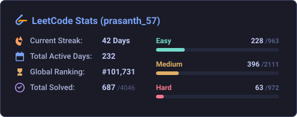

<h1 align="center">Hi 👋, I'm Prasanth P</h1>
<h3 align="center">Third-year CSE Student at PSG College of Technology | Backend Developer passionate about AI/ML integrations</h3>

---

### 👨‍💻 About Me

- 🔭 I’m currently working on **AI-driven agentic workflows and real-time backend systems**
- 🌱 I’m currently learning **Agentic Design Patterns & Advanced System Architecture**
- 👯 I’m looking to collaborate on **Open Source AI/ML projects**
- 📫 How to reach me: **[prasanth.k.prabhu@gmail.com](mailto:prasanth.k.prabhu@gmail.com)**

<h3 align="left">🌐 Connect with Me:</h3>

  
  

---

### 🛠️ Languages and Tools:

  
  
  
  
  
  
  
  
  
  
  
  
  
  
  
  
  
  
  
  
  

---

### ⚡ LeetCode Problem Solving & Streaks

  

---

### 📊 GitHub Statistics

  
  

  

---

### 🐍 GitHub Contribution Graph Animation

  <picture>
    <source media="(prefers-color-scheme: dark)" srcset="https://raw.githubusercontent.com/Prasanth866/Prasanth866/output/github-contribution-grid-snake-dark.svg">
    <source media="(prefers-color-scheme: light)" srcset="https://raw.githubusercontent.com/Prasanth866/Prasanth866/output/github-contribution-grid-snake.svg">
    
  </picture>

