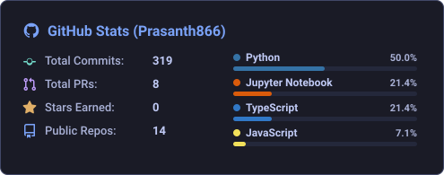

<h1 align="center">Hi, I'm Prasanth P</h1>
<h3 align="center">Third-year CSE Student at PSG College of Technology | Backend Developer passionate about AI/ML integrations</h3>

---

### About Me

- Currently working on **AI-driven agentic workflows and real-time backend systems**
- Currently learning **Agentic Design Patterns & Advanced System Architecture**
- Looking to collaborate on **Open Source AI/ML projects**
- How to reach me: **[prasanth.k.prabhu@gmail.com](mailto:prasanth.k.prabhu@gmail.com)**

---

## Tools and Technologies

### Programming Languages

### AI, Machine Learning & Data Science

### Web & Backend Development

### Databases & Cloud

### DevOps & Tools

---

### Connect & Profiles

  
  
  

---

### LeetCode Stats

  

---

### GitHub Stats

  

---

### GitHub Contributions

  <picture>
    <source media="(prefers-color-scheme: dark)" srcset="https://raw.githubusercontent.com/Prasanth866/Prasanth866/output/github-contribution-grid-snake-dark.svg">
    <source media="(prefers-color-scheme: light)" srcset="https://raw.githubusercontent.com/Prasanth866/Prasanth866/output/github-contribution-grid-snake.svg">
    
  </picture>

